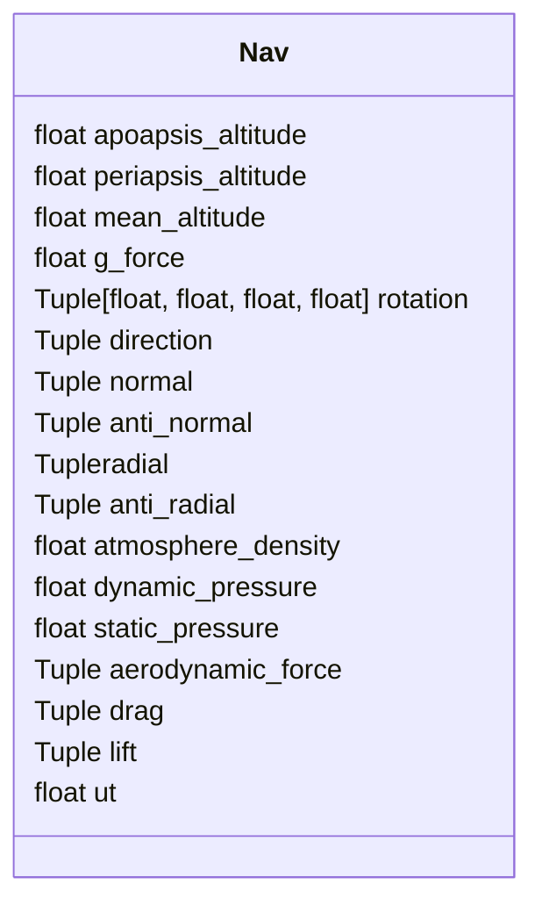

# Kerbal-ELK-Grafana




NAV Telemetry class parameters: 
```python
    o_apoapsis_altitude: float,  # The apoapsis of the orbit, in meters, above the sea level of the body being orbited.
    o_periapsis_altitude: float,  # The periapsis of the orbit, in meters, above the sea level of the body being orbited.
    f_mean_altitude: float,  # The altitude above sea level, in meters. Measured from the center of mass of the vessel.
    f_g_force: float,  # The current G force acting on the vessel in g.
    f_velocity: Tuple[float, float, float],  # The velocity of the vessel, in the reference frame
    f_speed: float,  # The speed of the vessel in meters per second, in the reference frame ReferenceFrame.
    f_horizontal_speed: float,  # conn.add_stream(getattr, avf, 'aerodynamic_force'),
    f_vertical_speed: float,  # The speed of the vessel in meters per second, in the reference frame ReferenceFrame.
    f_center_of_mass:  Tuple[float, float, float],  # The position of the center of mass of the vessel, in the reference frame
    f_rotation: Tuple[float, float, float, float],  # The rotation of the vessel, in the reference frame
    f_direction: Tuple[float, float, float],  # The direction that the vessel is pointing in, in the reference frame
    f_normal: Tuple[float, float, float],  # The direction normal to the vessels orbit, in the reference frame
    f_anti_normal: Tuple[float, float, float],  # The direction opposite to the normal of the vessels orbit, in the reference frame
    f_radial: Tuple[float, float, float],  # The radial direction of the vessels orbit, in the reference frame
    f_anti_radial: Tuple[float, float, float],  # The direction opposite to the radial direction of the vessels orbit, in the reference frame
    f_atmosphere_density: float,  # The current density of the atmosphere around the vessel, in kg/m3.
    f_dynamic_pressure: float,  # The dynamic pressure acting on the vessel, in Pascals. This is a measure of the strength of the aerodynamic forces. It is equal to 12.air density.velocity2. It is commonly denoted Q.
    f_static_pressure: float,  # The static atmospheric pressure acting on the vessel, in Pascals.
    f_aerodynamic_force: Tuple[float, float, float],  # The total aerodynamic forces acting on the vessel, in reference frame
    f_drag: Tuple[float, float, float],  # The aerodynamic drag currently acting on the vessel.
    f_lift: Tuple[float, float, float],  # The aerodynamic lift currently acting on the vessel.
    r_resources: List[Resource],  # Represents the collection of resources stored in a vessel, stage or part.
    ut: float  # The current universal time in seconds.
```